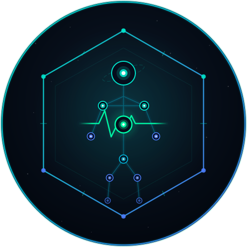

# ImmuForge

<p align="center">
  
</p>


OpenHealthOS is a **local-first, privacy-respecting personal health operating system**. It is designed to empower individuals to own, manage, and analyze their health, fitness, and physiological data without relying on cloud servers or compromising privacy.

## Features (Core Backend)
The foundation of OpenHealthOS is a robust, extensible SQLite data warehouse that currently supports tracking:
- **Activities**: Workouts, durations, and activity types.
- **Sleep Sessions**: Sleep duration and quality tracking.
- **HRV Readings**: Heart Rate Variability tracking for recovery metrics.
- **Nutrition Logs**: Calorie and macronutrient (protein) tracking.
- **Body Metrics**: Weight, resting heart rate, and VO2 Max.

## Tech Stack
- **Language**: Python 3.9+
- **Database**: SQLite (Local-first architecture)
- **ORM**: SQLAlchemy

## Getting Started

### Prerequisites
- Python 3.9 or higher
- A virtual environment manager (`venv`, `conda`, etc.)

### Installation
1. **Clone the repository:**
   ```bash
   git clone https://github.com/OpenHealthOS/openhealthos.git
   cd openhealthos
   ```

2. **Set up a Virtual Environment:**
   Create and activate a virtual environment in the `backend` directory.
   ```bash
   python3 -m venv backend/venv
   source backend/venv/bin/activate  # On Windows use `backend\venv\Scripts\activate`
   ```

3. **Install Dependencies:**
   Install SQLAlchemy and any other requirements.
   ```bash
   pip install sqlalchemy
   ```

## Contributing
We welcome contributions of all kinds! Whether you are adding new health metric models, building out an API, or designing the frontend, your help is appreciated. 

Please see our [CONTRIBUTING.md](CONTRIBUTING.md) for detailed instructions on how to report bugs, suggest enhancements, and submit Pull Requests.

## License
This project is open-source. Please refer to the `LICENSE` file for more details.
